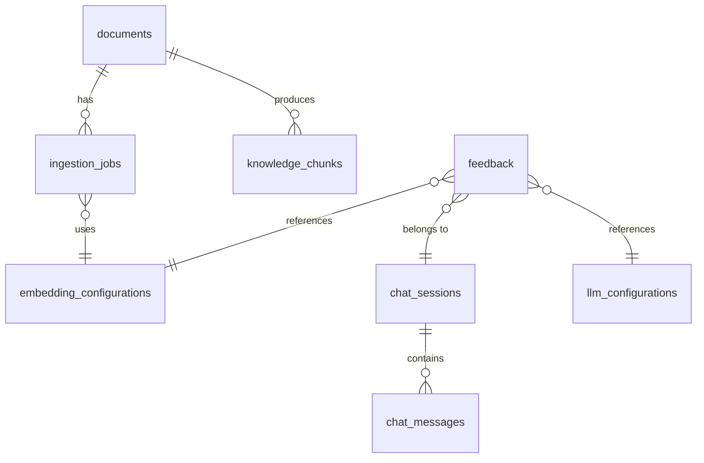

# Data Model: FLEXCUBE L1 Support Chatbot

**Feature**: 002-flexcube-support-chatbot
**Date**: 2026-08-26

---

## Entity Overview



---

## Documents

Represents an uploaded knowledge-base document.

| Column | Type | Notes |
|---|---|---|
| `id` | UUID PK | |
| `name` | VARCHAR(500) | Human-readable display name |
| `original_filename` | VARCHAR(500) | Stored for display only; never used as path |
| `file_type` | VARCHAR(10) | `pdf`, `docx`, `md` |
| `source_type` | VARCHAR(50) | `flexcube_manual`, `rca`, `jira_export`, `procedure`, `other` |
| `storage_path` | VARCHAR(1000) | UUID-prefixed path; never raw original filename |
| `checksum` | VARCHAR(64) | SHA-256 hex (UNIQUE — enforces duplicate detection FR-004) |
| `file_size_bytes` | BIGINT | |
| `status` | VARCHAR(40) | See IngestionStatus enum below |
| `uploaded_at` | TIMESTAMP | UTC |
| `updated_at` | TIMESTAMP | UTC; updated on every status transition |
| `description` | TEXT | Optional admin note |

**IngestionStatus Enum**:
`UPLOADED → QUEUED → PARSING → NORMALISING → CHUNKING → EMBEDDING → INDEXING →
COMPLETED | COMPLETED_WITH_WARNING | FAILED | DELETING → DELETED`

**COMPLETED_WITH_WARNING** (Q1 clarification, FR-006, SC-022):
Document is queryable. Inline warning detail stored in associated ingestion job.

**Unique constraint**: `UNIQUE (checksum)` — enforces FR-004.

---

## Ingestion Jobs

Tracks the asynchronous ingestion pipeline per document.

| Column | Type | Notes |
|---|---|---|
| `id` | UUID PK | |
| `document_id` | UUID FK → documents | |
| `status` | VARCHAR(40) | Mirrors IngestionStatus |
| `attempt_count` | INT | Default 0 |
| `max_attempts` | INT | Default 3 per retry-eligible stage |
| `last_error` | TEXT | Human-readable error (no stack traces — FR-039) |
| `last_error_category` | VARCHAR(50) | `PARSE_ERROR`, `EMBEDDING_ERROR`, `INDEX_ERROR` |
| `parse_warnings` | JSON | List of `{ element_type, description }` for COMPLETED_WITH_WARNING |
| `created_at` | TIMESTAMP | |
| `started_at` | TIMESTAMP | When worker claimed job |
| `completed_at` | TIMESTAMP | When terminal state reached |
| `chunking_config_snapshot` | JSON | Config at job start (for reproducibility) |
| `embedding_config_id` | UUID FK → embedding_configurations | |
| `chunks_created` | INT | |
| `chunks_indexed` | INT | |
| `worker_id` | VARCHAR(100) | For future multi-worker support |

---

## Knowledge Chunks

Chunk metadata in relational store; vectors in Qdrant.

| Column | Type | Notes |
|---|---|---|
| `id` | UUID PK | Matches Qdrant point ID |
| `document_id` | UUID FK → documents | |
| `ingestion_job_id` | UUID FK → ingestion_jobs | |
| `chunk_seq` | INT | 0-based sequence within document |
| `text_preview` | VARCHAR(500) | First 500 chars for display/debugging |
| `page_number` | INT | NULL if unavailable |
| `section_path` | VARCHAR(1000) | Breadcrumb: "Chapter 3 > Task Codes > BA435" |
| `task_code` | VARCHAR(20) | First-class retrieval signal |
| `screen_name` | VARCHAR(200) | |
| `module` | VARCHAR(100) | |
| `functional_area` | VARCHAR(200) | |
| `menu_path` | VARCHAR(500) | |
| `error_code` | VARCHAR(50) | |
| `jira_id` | VARCHAR(50) | |
| `rca_reference` | VARCHAR(100) | |
| `element_type` | VARCHAR(30) | `paragraph`, `table`, `procedure`, `heading`, etc. |
| `embedding_model_id` | VARCHAR(200) | `{provider}:{model}:{version}` — compatibility key |
| `indexed_at` | TIMESTAMP | UTC |

**Indexes**: `(document_id)`, `(task_code) WHERE NOT NULL`,
`(error_code) WHERE NOT NULL`, `(embedding_model_id)`.

---

## LLM Configurations

| Column | Type | Notes |
|---|---|---|
| `id` | UUID PK | |
| `provider` | VARCHAR(50) | `ollama`, `openai`, `azure_openai` |
| `model` | VARCHAR(200) | Model identifier |
| `endpoint` | VARCHAR(500) | Base URL |
| `temperature` | FLOAT | Default 0.1 (low for RAG groundedness) |
| `max_tokens` | INT | |
| `context_window` | INT | |
| `timeout_seconds` | INT | |
| `max_retries` | INT | |
| `extra_params` | JSON | Provider-specific parameters |
| `is_active` | BOOL | Only one active at a time |
| `label` | VARCHAR(200) | Admin-friendly name |
| `created_at` | TIMESTAMP | |
| `updated_at` | TIMESTAMP | |

**Note**: API key stored in env var only — NEVER in this table (FR-031).

---

## Embedding Configurations

| Column | Type | Notes |
|---|---|---|
| `id` | UUID PK | |
| `provider` | VARCHAR(50) | `openai_compatible`, `ollama` |
| `model` | VARCHAR(200) | |
| `model_version` | VARCHAR(100) | Stable version where available |
| `endpoint` | VARCHAR(500) | |
| `dimensions` | INT | Vector dimensionality |
| `distance_method` | VARCHAR(20) | `cosine`, `dot_product`, `euclidean` |
| `index_compat_id` | VARCHAR(300) | Must match `embedding_model_id` of indexed chunks |
| `batch_size` | INT | |
| `timeout_seconds` | INT | |
| `is_active` | BOOL | |
| `label` | VARCHAR(200) | |
| `created_at` | TIMESTAMP | |
| `updated_at` | TIMESTAMP | |

**Constraint**: Changing `is_active` to a different config MUST trigger compatibility
check. If existing index uses a different `index_compat_id`, re-index confirmation
required (FR-032, US12 scenario 4).

---

## Retrieval Configurations

| Column | Type | Default | Notes |
|---|---|---|---|
| `id` | UUID PK | | |
| `top_k_candidates` | INT | 20 | Total candidates before threshold |
| `final_top_k` | INT | 5 | Context chunks sent to LLM |
| `similarity_threshold` | FLOAT | 0.40 | Minimum relevance score |
| `dense_weight` | FLOAT | 0.70 | RRF fusion weight |
| `sparse_weight` | FLOAT | 0.30 | RRF fusion weight |
| `rerank_enabled` | BOOL | false | |
| `rerank_top_k` | INT | 20 | Candidates passed to reranker |
| `exact_id_boost` | BOOL | true | Exact-identifier filter always runs |
| `min_evidence_tokens` | INT | 100 | Evidence sufficiency threshold |
| `is_active` | BOOL | | |
| `created_at` | TIMESTAMP | | |
| `updated_at` | TIMESTAMP | | |

---

## Chunking Configurations

| Column | Type | Default | Notes |
|---|---|---|---|
| `id` | UUID PK | | |
| `strategy` | VARCHAR(50) | `SEMANTIC_STRUCTURE` | `FIXED_SIZE` for comparison |
| `target_chunk_tokens` | INT | 512 | |
| `min_chunk_tokens` | INT | 64 | |
| `max_chunk_tokens` | INT | 1024 | |
| `overlap_tokens` | INT | 64 | |
| `table_as_unit` | BOOL | true | Keep tables as single chunks |
| `procedure_grouping` | BOOL | true | Group steps under procedure heading |
| `is_active` | BOOL | | |
| `created_at` | TIMESTAMP | | |
| `updated_at` | TIMESTAMP | | |

**Note**: Changing `is_active` requires re-indexing all documents (same as embedding change).

---

## Chat Sessions

| Column | Type | Notes |
|---|---|---|
| `id` | UUID PK | Session token |
| `created_at` | TIMESTAMP | |
| `last_active_at` | TIMESTAMP | Updated on each message |
| `expires_at` | TIMESTAMP | `last_active_at + session_ttl_minutes` |
| `is_active` | BOOL | False after explicit clear or expiry |

**Initial release**: Session history is in-memory only. This table is created for future
persistence but `chat_messages` persistence is opt-in.

---

## Chat Messages (Future Persistence)

| Column | Type | Notes |
|---|---|---|
| `id` | UUID PK | |
| `session_id` | UUID FK → chat_sessions | |
| `role` | VARCHAR(20) | `user`, `assistant` |
| `content` | TEXT | |
| `turn_order` | INT | 0-based ordering |
| `created_at` | TIMESTAMP | |
| `answer_type` | VARCHAR(20) | `GROUNDED`, `PARTIAL`, `INSUFFICIENT`, `AMBIGUOUS` (assistant only) |
| `llm_config_id` | UUID FK | Config used for assistant messages |
| `retrieval_latency_ms` | INT | |
| `generation_latency_ms` | INT | |

---

## Feedback

| Column | Type | Notes |
|---|---|---|
| `id` | UUID PK | |
| `session_id` | UUID FK → chat_sessions | NULL if session expired |
| `question` | TEXT | Original user question |
| `answer_text` | TEXT | Generated answer |
| `answer_type` | VARCHAR(20) | Answer type at time of feedback |
| `rating` | VARCHAR(20) | `helpful`, `not_helpful` |
| `comment` | VARCHAR(1000) | Optional (FR-026) |
| `llm_config_id` | UUID FK → llm_configurations | |
| `embedding_config_id` | UUID FK → embedding_configurations | |
| `retrieval_config_id` | UUID FK → retrieval_configurations | |
| `retrieved_chunk_ids` | JSON | Array of chunk UUIDs used in answer |
| `insufficient_information` | BOOL | Was an insufficient-info response returned? |
| `submitted_at` | TIMESTAMP | |

---

## Document Lifecycle State Transitions

```
UPLOADED → QUEUED → PARSING → NORMALISING → CHUNKING → EMBEDDING → INDEXING
                                                                          → COMPLETED
                                                                          → COMPLETED_WITH_WARNING  ← Q1 clarification
                 → FAILED (any stage, retries exhausted)
COMPLETED / COMPLETED_WITH_WARNING / FAILED → DELETING → DELETED
COMPLETED / COMPLETED_WITH_WARNING / FAILED → QUEUED (re-index)

Active ingestion (`PARSING`, `NORMALISING`, `CHUNKING`, `READY_FOR_INDEXING`,
`READY_FOR_INDEXING_WITH_WARNING`, `EMBEDDING`, or `INDEXING`) + deletion request:
block deletion and return `DOCUMENT_IN_PROCESSING`. The active ingestion job continues
unchanged, and deletion can be retried after a terminal state is reached.
```

**Terminal states**: `COMPLETED`, `COMPLETED_WITH_WARNING`, `FAILED`, `DELETED`
